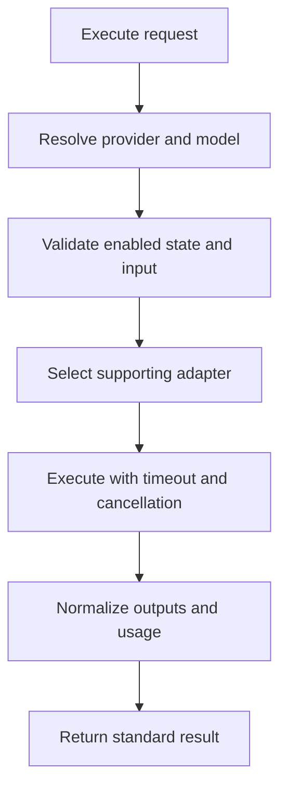
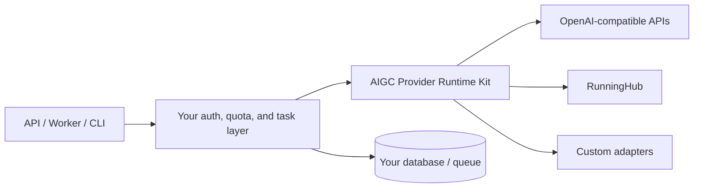

# AIGC Provider Runtime Kit

[](https://github.com/Hhh2178/aigc-provider-runtime-kit/actions/workflows/ci.yml)
[](./LICENSE)
[](https://nodejs.org/)
[](https://www.typescriptlang.org/)

A framework-neutral TypeScript runtime for applications that need to configure, validate, and execute multiple AIGC providers through one stable interface.

Define providers and models once, connect provider-specific adapters, and execute chat, image, video, audio, or workflow models without spreading provider branching throughout your application.

> Current release line: `0.2.x`. The package is usable in applications, but its public API may still evolve before `1.0`.

## Why this project exists

AIGC applications usually repeat the same infrastructure:

- provider and model configuration;
- model-specific parameter validation;
- provider selection and request dispatch;
- synchronous and asynchronous task handling;
- normalized image, video, audio, and text results;
- timeouts, cancellation, retries, and structured errors;
- progress events, audit hooks, and API-key concurrency control.

`aigc-provider-runtime-kit` provides these pieces as a reusable SDK. Your product keeps control of credentials, persistence, queues, authentication, permissions, billing, and user-facing UI.

## Highlights

- **One execution API** — call configured models through `runtime.execute(...)`.
- **Validated registry** — reject invalid URLs, duplicate IDs, and dangling model/provider references early.
- **Model-aware input validation** — required fields, types, options, numeric ranges, list limits, and input capabilities.
- **Adapter architecture** — built-in bridges for OpenAI-compatible APIs and RunningHub, plus a small custom adapter contract.
- **Standard results** — normalize text, image, video, audio, JSON, usage, task IDs, and raw provider payloads.
- **Bounded execution** — request/task timeouts and `AbortSignal` cancellation, including protection from adapters that ignore cancellation.
- **Structured errors** — distinguish configuration, validation, adapter, upstream, timeout, and result failures.
- **Observability hooks** — receive lifecycle and progress events without coupling the SDK to a logging platform.
- **RunningHub utilities** — App/Workflow descriptors, submit/poll client, output extraction, and Redis-like key concurrency.
- **Release-grade package checks** — TypeScript strict mode, CI, tests, package export checks, and installed-tarball smoke tests.

## What this package is — and is not

| Included | Owned by your application |
| --- | --- |
| Provider/model contracts and registry | API-key and secret storage |
| Input schema validation | Database and migrations |
| Unified runtime and adapter contract | Authentication and permissions |
| OpenAI-compatible and RunningHub clients | Queue and worker infrastructure |
| Standard outputs, errors, events, and retries | Billing, quotas, and product policies |
| Multipart and key-pool helpers | Admin UI and end-user UI |

This repository is an SDK, not a hosted API service or complete SaaS backend.

## Requirements

- Node.js 22 or newer
- ESM (`"type": "module"`)
- Runtime support for `fetch`, `FormData`, `Blob`, and `AbortSignal`
- TypeScript is recommended but not required by consumers

## Installation

Install from npm after the package is published:

```bash
npm install aigc-provider-runtime-kit
```

Until then, install directly from GitHub:

```bash
npm install github:Hhh2178/aigc-provider-runtime-kit
```

## Package Entrypoints

| Entrypoint | Use it for |
| --- | --- |
| `aigc-provider-runtime-kit` | All public exports |
| `aigc-provider-runtime-kit/runtime` | Unified execution contracts, runtime, validation, and adapters |
| `aigc-provider-runtime-kit/core` | Registry, schemas, multipart, retry, and OpenAI-compatible client |
| `aigc-provider-runtime-kit/runninghub` | RunningHub client, descriptors, output extraction, and key pool |

## Quick start: unified OpenAI-compatible execution

The example below creates a registry, connects an OpenAI-compatible client, and executes an image model through the unified runtime.

```ts
import {
  createOpenAICompatibleAdapter,
  createOpenAICompatibleClient,
  createProviderRegistry,
  createProviderRuntime,
  isProviderRuntimeError
} from "aigc-provider-runtime-kit/runtime";

const registry = createProviderRegistry({
  providers: [
    {
      id: "primary-api",
      name: "Primary OpenAI-compatible API",
      baseUrl: "https://api.example.com/v1",
      protocol: "openai",
      enabled: true
    }
  ],
  models: [
    {
      id: "image-primary",
      providerId: "primary-api",
      modelId: "provider-image-model",
      displayName: "Primary image model",
      capability: "image",
      enabled: true,
      parameterSchema: {
        prompt: { type: "string", required: true },
        size: {
          type: "select",
          options: ["1024x1024", "1536x1024", "1024x1536"],
          default: "1024x1024"
        }
      }
    }
  ]
});

const client = createOpenAICompatibleClient({
  baseUrl: "https://api.example.com/v1",
  apiKey: process.env.PROVIDER_API_KEY!
});

const runtime = createProviderRuntime({
  registry,
  adapters: [createOpenAICompatibleAdapter({ client })],
  hooks: {
    onEvent(event) {
      console.log(event.type);
    }
  }
});

try {
  const result = await runtime.execute({
    providerId: "primary-api",
    modelId: "image-primary",
    input: {
      prompt: "A cinematic tropical city at sunrise",
      size: "1536x1024"
    },
    timeoutMs: 120_000
  });

  for (const output of result.outputs) {
    console.log(output.type, output.url ?? output.text);
  }
} catch (error) {
  if (isProviderRuntimeError(error)) {
    console.error(error.code, error.issues);
  }
  throw error;
}
```

Important identifiers:

- `provider.id` is your internal provider ID.
- `model.id` is the internal ID passed to `runtime.execute`.
- `model.modelId` is the upstream provider's model identifier.

## Execution lifecycle



The standard result shape is:

```ts
interface ProviderExecutionResult {
  status: "completed";
  providerId: string;
  modelId: string;
  capability: "chat" | "image" | "video" | "audio";
  taskId?: string;
  outputs: Array<{
    type: "text" | "image" | "video" | "audio" | "json";
    url?: string;
    text?: string;
    mimeType?: string;
    data?: unknown;
  }>;
  usage?: {
    inputTokens?: number;
    outputTokens?: number;
    totalTokens?: number;
  };
  raw?: unknown;
}
```

Use normalized fields in application logic. Keep `raw` for debugging or provider-specific metadata.

## Runtime events

Pass `hooks.onEvent` to observe execution without changing runtime behavior:

```ts
const runtime = createProviderRuntime({
  registry,
  adapters,
  hooks: {
    async onEvent(event) {
      switch (event.type) {
        case "execution.progress":
          console.log(event.progress.percent, event.progress.status);
          break;
        case "execution.succeeded":
          console.log(`Completed in ${event.durationMs}ms`);
          break;
        case "execution.failed":
          console.error(event.error);
          break;
      }
    }
  }
});
```

Available events:

- `execution.started`
- `execution.validated`
- `adapter.selected`
- `execution.progress`
- `execution.succeeded`
- `execution.failed`

Hook failures are isolated and never change the provider execution result.

## Cancellation and timeouts

```ts
const controller = new AbortController();

const pending = runtime.execute({
  providerId: "primary-api",
  modelId: "image-primary",
  input: { prompt: "A cinematic rainforest" },
  signal: controller.signal,
  timeoutMs: 120_000
});

// Cancel from your HTTP request, worker shutdown, or user action.
controller.abort("user_cancelled");

await pending;
```

The runtime enforces its own deadline even when a third-party adapter does not handle the abort signal correctly.

## OpenAI-compatible APIs

Use the low-level client directly when unified execution is unnecessary:

```ts
import { createOpenAICompatibleClient } from "aigc-provider-runtime-kit/core";

const client = createOpenAICompatibleClient({
  baseUrl: "https://api.example.com/v1",
  apiKey: process.env.PROVIDER_API_KEY!,
  requestTimeoutMs: 120_000,
  retry: {
    maxAttempts: 3,
    baseDelayMs: 500,
    maxDelayMs: 5_000,
    jitter: 0.2
  }
});

const response = await client.createChatCompletion({
  model: "chat-model",
  messages: [{ role: "user", content: "Hello" }]
});
```

The client provides:

- `request(path, body, options?)`
- `createChatCompletion(body, options?)`
- `createImage(body, options?)`

Retries are opt-in. This avoids silently duplicating generation requests or charges. With a retry policy, only network failures, HTTP `408`, `409`, `429`, and `5xx` responses are retried.

For nonstandard video or audio endpoints, configure adapter endpoint paths:

```ts
const adapter = createOpenAICompatibleAdapter({
  client,
  endpoints: {
    video: "videos/generations",
    audio: "audio/generations"
  },
  normalize(raw, context) {
    // Convert the provider-specific response into ProviderExecutionResult.
    return normalizeVendorResult(raw, context);
  }
});
```

## RunningHub integration

Create the client and describe the workflow mapping in the model's `advancedConfig`:

```ts
import {
  createProviderRegistry,
  createProviderRuntime,
  createRunningHubAdapter,
  createRunningHubClient
} from "aigc-provider-runtime-kit/runtime";

const registry = createProviderRegistry({
  providers: [
    {
      id: "runninghub",
      name: "RunningHub",
      baseUrl: "https://www.runninghub.cn",
      protocol: "runninghub",
      enabled: true
    }
  ],
  models: [
    {
      id: "workflow-video",
      providerId: "runninghub",
      modelId: "workflow-video",
      displayName: "RunningHub video workflow",
      capability: "video",
      enabled: true,
      parameterSchema: {
        prompt: { type: "string", required: true }
      },
      advancedConfig: {
        runninghub: {
          targetType: "workflow",
          runTargetId: "workflow-id",
          workflowId: "workflow-id",
          fieldMap: {
            prompt: { nodeId: "6", fieldName: "prompt" }
          }
        }
      }
    }
  ]
});

const runningHubClient = createRunningHubClient({
  baseUrl: "https://www.runninghub.cn",
  apiKey: process.env.RUNNINGHUB_API_KEY!
});

const runtime = createProviderRuntime({
  registry,
  adapters: [createRunningHubAdapter({ client: runningHubClient })]
});

const result = await runtime.execute({
  providerId: "runninghub",
  modelId: "workflow-video",
  input: { prompt: "A robot walking through a neon street" },
  timeoutMs: 10 * 60_000
});

console.log(result.taskId, result.outputs);
```

You may replace `advancedConfig.runninghub` mapping with a custom `resolveRunInput(context)` function when workflow inputs need more control.

### RunningHub key concurrency

The key-pool helper works with a Redis-like runtime and prevents a key from exceeding its configured concurrency:

```ts
import {
  acquireRunningHubKey,
  releaseRunningHubKey
} from "aigc-provider-runtime-kit/runninghub";

const acquired = await acquireRunningHubKey({
  providerId: "runninghub",
  defaultConcurrency: 2,
  leaseSeconds: 60 * 60,
  runtime: redisLikeRuntime,
  keys
});

if (!acquired.acquired || !acquired.key) {
  throw new Error(acquired.reason);
}

try {
  // Execute with acquired.key.apiKey.
} finally {
  await releaseRunningHubKey({
    providerId: "runninghub",
    keyId: acquired.key.id,
    runtime: redisLikeRuntime
  });
}
```

Set the lease longer than the longest expected task. The default lease is one hour.

## Model schemas and UI metadata

Parameter schemas can drive both runtime validation and admin/canvas UI controls:

```ts
import {
  defaultParameterSchemaForModel,
  uiMetadataFromSchema
} from "aigc-provider-runtime-kit/core";

const schema = defaultParameterSchemaForModel(
  "video",
  "video-model",
  "custom"
);

const metadata = uiMetadataFromSchema(schema, "video");

console.log(metadata.aspectRatios);
console.log(metadata.durationOptions);
console.log(metadata.inputCapabilities);
```

Runtime validation supports:

- required fields;
- string, number, integer, boolean, select/enum, and array types;
- allowed options;
- numeric minimum and maximum values;
- maximum array lengths;
- image, audio, video, first-frame, last-frame, and mask capabilities.

## Custom adapters

Implement one small interface to connect another provider:

```ts
import type { ProviderAdapter } from "aigc-provider-runtime-kit/runtime";

export const customAdapter: ProviderAdapter = {
  id: "custom-provider",

  supports(provider, model) {
    return provider.id === "custom-provider" && model.capability === "video";
  },

  async execute(context) {
    const raw = await callVendorApi({
      model: context.model.modelId,
      input: context.input,
      signal: context.signal
    });

    await context.emitProgress({ status: "completed", percent: 100 });

    return {
      status: "completed",
      providerId: context.provider.id,
      modelId: context.model.id,
      capability: context.model.capability,
      taskId: raw.taskId,
      outputs: raw.urls.map((url: string) => ({ type: "video", url })),
      raw
    };
  }
};
```

## Error model

| Error | Scope |
| --- | --- |
| `ProviderRegistryValidationError` | Invalid provider/model registry configuration |
| `ProviderRuntimeError` | Missing/disabled config, invalid input, adapter selection/failure, timeout/cancellation |
| `OpenAICompatibleError` | OpenAI-compatible HTTP, abort, or JSON response failure |
| `RunningHubError` | RunningHub configuration, submit, poll, timeout, status, or output failure |

Each error family includes a type guard:

```ts
if (isProviderRuntimeError(error)) {
  console.error(error.code, error.providerId, error.modelId, error.issues);
}
```

Adapter errors are preserved as `cause` on `ProviderRuntimeError`.

## Recommended architecture



Keep secrets and product policies outside the SDK. Inject already configured clients into adapters.

## Common use cases

- multi-provider AIGC backends;
- provider and model management systems;
- visual workflow or canvas runtimes;
- image/video generation workers;
- RunningHub App/Workflow gateways;
- reusable provider infrastructure shared across products.

## Repository layout

```text
packages/core/        Provider contracts, registry, schemas, multipart, retry, OpenAI-compatible client
packages/runninghub/  RunningHub descriptors, client, output extraction, and key-pool helpers
packages/runtime/     Unified runtime contracts, validation, execution, and adapters
examples/             Minimal TypeScript usage examples
tests/                Public behavior and contract tests
docs/                 System docs, API reference, governance, roadmap, and work logs
scripts/              Harness and installed-package verification
.github/workflows/    GitHub Actions CI
```

## Local Development

```bash
git clone https://github.com/Hhh2178/aigc-provider-runtime-kit.git
cd aigc-provider-runtime-kit
npm ci
npm run harness:verify:release
```

Individual commands:

```bash
npm run harness:verify:project  # Required repository/docs anchors
npm run type-check              # Strict TypeScript validation
npm run build                   # JavaScript, declarations, and source maps
npm test                        # Node built-in test suite
npm run test:package            # Pack, install, and import the real tarball
```

The release gate must pass before merging, tagging, or publishing.

## Documentation

- [Getting started](./docs/getting-started.md)
- [API reference](./docs/api-reference.md)
- [Unified runtime architecture](./docs/systems/runtime/README.md)
- [Provider system](./docs/systems/providers/README.md)
- [RunningHub system](./docs/systems/runninghub/README.md)
- [Roadmap](./docs/roadmap.md)
- [Contributing](./CONTRIBUTING.md)
- [Security policy](./SECURITY.md)
- [Changelog](./CHANGELOG.md)

## Security

Never commit API keys, `.env` files, private keys, production credentials, customer data, or server output.

Host applications remain responsible for secret management, access control, egress policy, rate limits, quotas, audit retention, and incident response. See [SECURITY.md](./SECURITY.md).

## Project status

Version `0.2.0` provides the unified runtime foundation. Planned work includes provider-specific video adapters, real-world provider fixtures, idempotency guidance, configuration loaders, and optional observability bridges. See [the roadmap](./docs/roadmap.md).

## Contributing

Contributions are welcome. Keep public changes typed, tested, documented, and framework-neutral. See [CONTRIBUTING.md](./CONTRIBUTING.md).

## License

MIT © contributors. See [LICENSE](./LICENSE).
